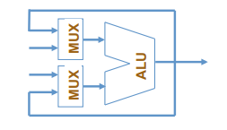
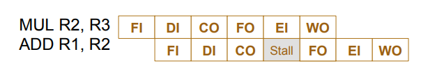
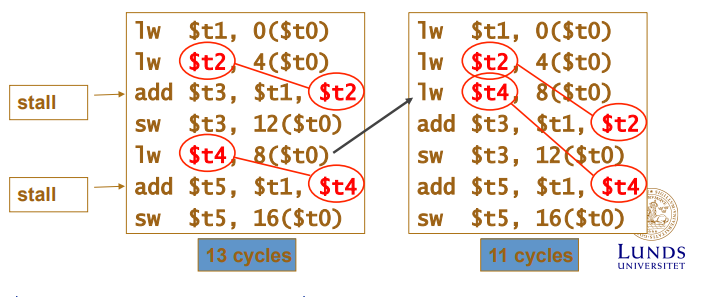
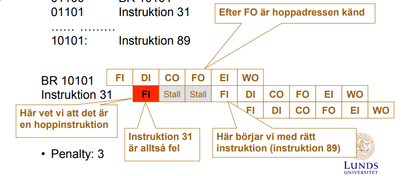
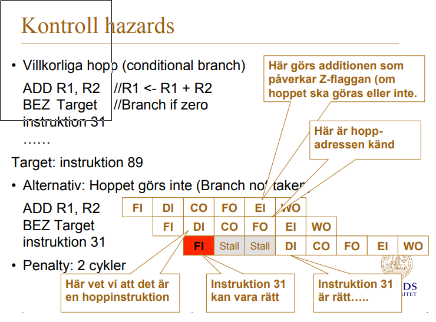
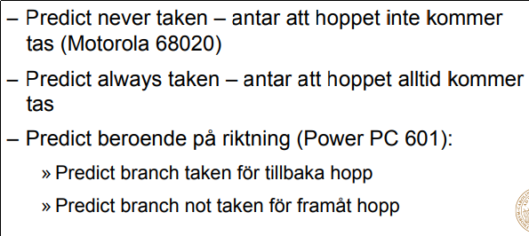
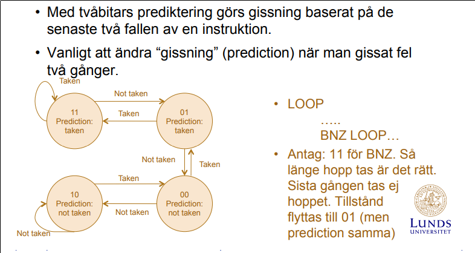

# Instuderingsfrågor 2017

## Processorn

1. __Vad är Moores lag?__
    
    Observation av att antalet transistorer dubblas varje år.

    __Vad är Murphys lag?__

    _"Om något kan gå fel kommer det förr eller senare att göra det"_
    
    Lycka till på tentan.

2. __Vem är von Neumann?__

    Pionjär inom mängdlära, spelteori, kvantfysik och datavetenskap.
    Grundare till von Neumann-arkitekturen som har använts sedan 1940-talet.

3. __Vad gör en kompilator?__

    Transformerar källkod till ett annat datorspråk.
    Detta kan vara maskinkod, eller ett mellanspråk.

4. __Vad gör en assemblator?__

    Översätter assembler till maskinkod.

5. __Ge exempel på ett högnivåspråk?__

    Java

6. __Vad skiljer ett högnivåspråk från ett maskinspråk?__

    Maskinspråk är binärkod som procerssorn direkt kan tolka.
    Högnivåspråk kan ej tolkas av processorn och har en hög abstraktionsnivå.

7. __Görs alla beräkningar (ADD, SUB, ..., AND, OR) i ALU:n?__

    Alla integer beräkningar görs av ALU:n, men till flyttal
    används en FPU (Floating-point-unit).

8. __Ge exmpel på indata och utdata till en kontrollenhet.__

    In- och utdata för ALU och Kontrollenhet

        Kontrollenhet
        Indata:
        00001   01110001    011
        MOVE    ADDRESS     REGISTER
        Utdata: "Säga till processorn vilken operation och vilka register som skall användas"

        ALU
        Indata:
        IN1, IN2, + Eventuella statussignaler
        Utdata:
        UT, + Eventuella statussignaler

9. __Ge exempel på fördelar med att använda register för att lagra data.__

    Accesstiden för registerlagring är flera potenser snabbare.
    Access av data i processorregister förväntas ta få antal ns, 
    L1 tar ~10ns, L2 10-tal ns, RAM ~100ns (Primärminne), HDD 10-tal ms (Sekundärminne).

10. __Om en processor gör _fetch_ och _execute_, vad gör under _fetch_? Vad görs under _execute_? Är det som görs under _fetch_ samma för alla instruktioner?__

    Under Fetch hämtas instruktion där PC pekar och flyttar instruktionen till CPU:n 
    där kontrollenheten avkodar instruktionen, under execute hämtas datan och operationen 
    görs för att sedan lagra detta i ett register. Ja, 100%.

11. __Ge exempel på system där man hittar datorer.__

    Apollos vägledningsdator. Industrisammanhang. Algoritmisk börshandel. Dammportar.

12. __Vad finns det för olika typer av datorer?__

    Smartphone, bärbar dator, persondator, superdator, minidator, servrar?

13. __Var kan man hitta processorer?__

    Överallt! Microprocessorer överallt, miniräknare, programmerbara styrsystem osv.

14. __Vad kännetecknar ett minne som är _volatile_?__

    Flyktigt minne, RAM, återställs/töms när strömtillförseln stryps.

15. __Ge exempel på minnen som är _volatile_.__

    RAM (Primärminne) och Processorregister

16. __Vad kännetecknar ett minne som är _non-volatile_?__

    Minne som kvarstår, bevaras och kan förflyttas fysiskt utan systemkoppling.

17. __Ge exempel på minnen som är _non-volatile_.__

    HDD (Sekundärminne) roterande skivor med magnetisk beläggning.

18. __Vid IC tillverkning, vad gör en dicer?__

    Skär ut rektangulära chip-skivor ur de stora runda siliconskivorna.

19. __Vem grundade Intel?__

    Gordon E. Moore och Robert Noyce

    __Vem grundade AMD?__

    Jerry Sanders III och Edwin Turney

20. __Vad är Moores lag?__

    Se svar till fråga 1.

21. __Vad består en von Neumann-arkitektur av?__

    

22. __Vad används en kompilator till?__

    Se svar till fråga 3.

23. __Vad är skillnaden mellan ett högnivåspråk och maskinkod?__

    Se svar till fråga 6.

24. __Ge exempel på högnivåspråk.__

    Se svar till fråga 5.

25. __Vad händer under _fetch_ fasen?__

    1. Vi hämtar instruktionen där PC pekar
    2. Vi flyttar instruktionen till CPU:n
    3. Kontrollenheten avkodar instruktionen till operationer 
    som processorn skall göra med specifierade register.

26. __Vad händer under _execute_ fasen?__

    1. Vi exekverar den operation som Fetch gav oss.
    Detta kan vara att hämta data eller göra en beräkning.
    2. Vi lagrar datan i det register eller på den minnesplats Fetch gav oss.

27. __Vad är en ALU?__

    Arithmetic Logic Unit (Aritmetisk Logisk Enhet) som utför logiska operationer 
    så som AND, OR, ADD och SUB.

28. __Varför finns registren i en processor?__

    För snabb åtkomst av data samt mellanlagring vid beräkningar.

29. __Nämn olika typer av register?__

    Data register, Address register (har stack pointern), Generella register, 
    Status register (ex. bool flaggor för jämförelser) osv.

30. __Hur många flanker finns det i en klockcykel?__

31. __Hur många bitar behövs för att lagra ett tal som har värden mellan 0 och 255?__

    8 bits

32. __Hur många bitar behövs för att lagra en _unsigned char_?__

    1 byte = 8 bits

33. __Vilka värden kan en _unsigned char_ ha?__

    0-255

34. __Hur fungerar 2-komplement?__

    Den första biten avgör om talet är positivt eller negativt, 1 negativt, 0 positivt. 
    Om inledande bit är 1 och följande 7 också är 1, dvs. 1111 1111, har vi -1. 
    Detta kan ses som att man har -128 och adderar 0111 1111 (127) vilket blir -1. 
    0000 0000 blir fortfarande 0. Övre gräns blir 127, undre -128.

35. __Vad är Little Endian?__

    En variation av hur vi representerar tal vid lagring i minne.

    Little Endian byter att du lagrar den minst signifikanta biten först.
    Om vi har ett ord 0A 0B 0C 0D kan vi lagra detta i minnet som 0D, 0C, 0B, 0A. 
    I Big Endian (American Supersize-Me Endian) hade vi lagrat 0A, 0B, 0C, 0D.

36. __Vad gör en kontrollenhet i en processor?__

    Se svar 25.3 till fråga 25.

37. __Hur lång är en klockperiod i en processor som har en frekvens på 1GHz?__

    1/1Ghz = 1ns

38. __Om varje instruktion tar 10 klockcykler, hur många instruktioner hinner en processor om frekvensen är 1GHz?__

    1Ghz/10 = 0.1G = 100M

39. __Hur kan val av algoritm påverka hur snabbt ett program exekverar?__

    Vi kan minska antalet instruktioner för att ex. komma åt ett värde i en datastruktur 
    dvs. göra en sökning efter ett värde i en struktur.

40. __Hur påverkar läsning och skrivning till minne prestandan hos en processor?__

    Enormt, om vi säger att en instruktion tar 10 klockcykler med en 1Ghz processor 
    så tar en instruktion 10ns, jämför detta med att hämta datan först från primärminne, 100ns, 
    och sekundärminne, 10 000 000ns.

41. __Vad blir det binära talet 0b101111 decimalt?__

    47

42. __Vad blir det binära talet 0b101111 hexadecimalt?__

    0x2F

43. __Vad blir det hexadecimala talet 0xFE1A decimalt?__

    65050

44. __Vad blir det hexadecimala talet 0xFE1A binärt?__

    0b1111111000011010

## Pipelining

1. __Vad är pipelining?__

    Pipelining är när vi kör flera olika intruktioner samtidigt. Exempelvis, om 
    vi har instruktionerna Fetch och Execute så kan vi köra en Fetch och en Execute samtidigt 
    men aldrig 2 Fetch samtidigt.

2. __Vilka konflikter kan uppstå i en pipeline?__
    
        Fetch instruction (FI)
        Decode instruction (DI)
        Calculate operand address (CO)
        Fetch operand (FO)
        Execute instruction (EI)
        Write operand (WO)
    
    __Strukturella Hazards__

    Resursproblem, vi kan ej göra fetch av instruktion och operand samtidigt från _minne_. 
    Detta kan lösas genom att förskjuta en pipeline med 1 nop, om hämtning görs i register händer inget.

    Vi kan också lösa detta genom att ha ett cacheminne för instruktioner och ett för data (operander).

    __Data Hazards__

    Om en instruktion gör en beräkning och nästa instruktion är beroende av den instruktionen 
    så får vi ett gammalt värde om vi ej stallar 2 cykler.

        FI  DI  CO  FO  EI  <WO>                (MUL R2, R3)

            FI  DI  CO  <FO>  EI  WO            (ADD R1, R2) (FO before WO)

                FI  DI  CO  <FO>  EI  WO        (FO collides with WO)

                    FI  DI  CO  <FO>  EI  WO    (FO after WO, this is OK)

    För att minska stalls (penalty) kan forwarding/bypassing användas. 
    Detta innebär att vi kan placera resultatet på ALU:ns ingång direkt.

    

    Vi får nu 1 stall istället:

    

    Vi kan även ändra ordningen på instruktioner för att inte ha efterliggnade registeraccess, se figur

    

    __Kontroll Hazards__

    Uppstår på grund av hopp (branching).

    _Unconditional Branch_

    Vi försöker alltid beräkna nästa instruktion i en pipeline, 
    men om vi har ett hopp så skall vi ju inte hämta den nästliggande instruktionen. 
    Detta innebär att vi gör en fetch i onödan och vi måste vänta 2 stalls och 
    en felläsning innan vi vet vilken instruktion som är den vi skall hämta 
    (måste göra en fetch operand på branchen där operanden är hoppaddressen), se figur.

    

    _Conditional Branch_

    Samma princip gäller här, men här får vi 2 stalls även om vi inte skall hoppa. 
    Vi måste även vänta här på att BEZ branchen har FO rätt address, även om det är nästa.

    

3. __Illustrera hur konflikter uppstår?__

    Se svar till fråga 2.

4. __Vad kan man göra för att undvika konflikter?__

    Se svar till fråga 2.

5. __Vad är branch prediction?__

    _Statisk prediktion_
    Gör ett fast antagande, se figur.

    

    _Dynamisk prediktion_

    Vi kan göra en kvalificerad gissning för huruvida ett hopp kommer att ske eller ej. 

    __1-bit__: Om vi har gjort ett hopp tidigare kan vi gissa att det kommer att 
    göras igen.

    __2-bit__: Görs med hjälp av en state machine, se figur nedan.

    

6. __Vad är spekulativ exekvering?__

    När vi börjar exekvera instruktioner baserat på tidigare nämnd branch prediction.

7. __Delayed branching - vad är det? Vinst? Ge exempel.__

    Det är när vi beräknar en instruktion som skall göras men ej påverkar branchen efter 
    branch instruktionen. Då slipper vi en eventuell stall efter i det fall då vi inte skulle 
    göra den beräkningen ((un)conditional branch stall). Nu gör vi alltid en beräkning som 
    alltid ska göras, på så sätt får vi inte en (2-3) onödig stall varje gång efter branch.

    Assemblatorn lägger alltid en _nyttig_ beräkning efter branchen med delay. 
    Innan hade vi alltid stalls.

## Minne

## Operativsystem

## Cacheminne

## Parallellism

