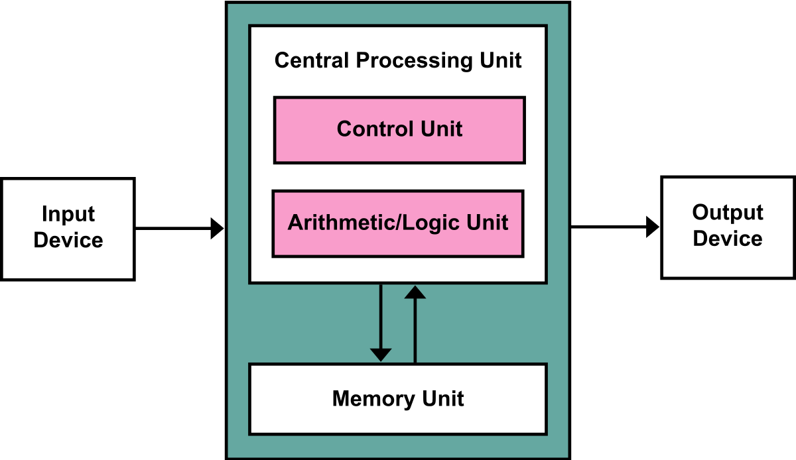

# Instuderingsfrågor 2017

## Processorn

1. Observation av att antalet transistorer dubblas varje år.

2. Pionjär inom mängdlära, spelteori, kvantfysik och datavetenskap.
Grundare till von Neumann-arkitekturen som har använts sedan 1940-talet.

3. Transformerar källkod till ett annat datorspråk.
Detta kan vara maskinkod, eller ett mellanspråk.

4. Översätter assembler till maskinkod.

5. Java

6. Maskinspråk är binärkod som procerssorn direkt kan tolka.
Högnivåspråk kan ej tolkas av processorn och har en hög abstraktionsnivå.

7. Alla integer beräkningar görs av ALU:n, men till flyttal
används en FPU (Floating-point-unit).

8. In- och utdata för ALU och Kontrollenhet

        Kontrollenhet
        Indata:
        00001   01110001    011
        MOVE    ADDRESS     REGISTER
        Utdata: "Säga till processorn vilken operation och vilka register som skall användas"

        ALU
        Indata:
        IN1, IN2, + Eventuella statussignaler
        Utdata:
        UT, + Eventuella statussignaler

9. Accesstiden för registerlagring är flera potenser snabbare.
Access av data i processorregister förväntas ta få antal ns, 
L1 tar ~10ns, L2 10-tal ns, RAM ~100ns (Primärminne), HDD 10-tal ms (Sekundärminne).

10. Under Fetch hämtas instruktion där PC pekar och flyttar instruktionen till CPU:n 
där kontrollenheten avkodar instruktionen, under execute hämtas datan och operationen 
görs för att sedan lagra detta i ett register. Ja, 100%.

11. Apollos vägledningsdator. Industrisammanhang. Algoritmisk börshandel. Dammportar.

12. Smartphone, bärbar dator, persondator, superdator, minidator, servrar?

13. Överallt! Microprocessorer överallt, miniräknare, programmerbara styrsystem osv.

14. Flyktigt minne, RAM, återställs/töms när strömtillförseln stryps.

15. RAM (Primärminne) och Processorregister

16. Minne som kvarstår, bevaras och kan förflyttas fysiskt utan systemkoppling.

17. HDD (Sekundärminne) roterande skivor med magnetisk beläggning.

18. Skär ut rektangulära chip-skivor ur de stora runda siliconskivorna.

19. Gordon E. Moore och Robert Noyce

20. Se svar till fråga 1.

21. 

22. Se svar till fråga 3.

23. Se svar till fråga 6.

24. Se svar till fråga 5.

25. 
    1. Vi hämtar instruktionen där PC pekar
    2. Vi flyttar instruktionen till CPU:n
    3. Kontrollenheten avkodar instruktionen till operationer 
    som processorn skall göra med specifierade register.

26. 
    1. Vi exekverar den operation som Fetch gav oss.
    Detta kan vara att hämta data eller göra en beräkning.
    2. Vi lagrar datan i det register eller på den minnesplats Fetch gav oss.

27. Arithmetic Logic Unit (Aritmetisk Logisk Enhet) som utför logiska operationer 
så som AND, OR, ADD och SUB.

28. 
